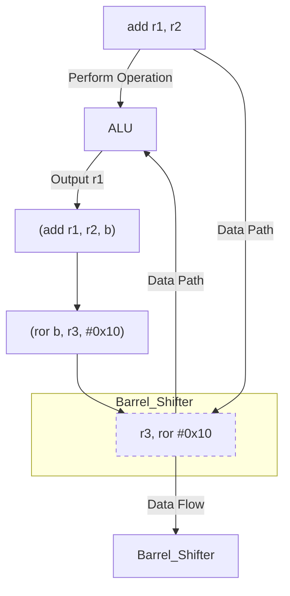

<style>
  .side-by-side {
    display: flex;
    gap: 10px;
    padding-top: 20px;
    padding-bottom: 20px;
  }
  .box {
    flex: 1;
    border: none;
    box-sizing: border-box;
  }
  @media (max-width: 400px) {
            .side-by-side {
                flex-direction: column;
            }
        }
</style>
The inline barrel shifter feature, also known as the constant shift feature, allows to
optionally shift the Rn operand for most instructions before it is processed by the
main instruction. This is a hallmark feature of ARM processors and is widely used in
optimization by programmers and compilers alike.


When an instruction includes a shift to its Rn operand, this is evaluated first.

For example `add r1, r2, r3 ror #0x10` should be interpreted as `r1 = r2 + ror(r3, 0x10)`.

<div class="side-by-side">
  <div class="box">

```verilog {filename="sample a"}
   mov r0, #10
   mov r1, #12
   ror r1, #2
   add r0, r1, r1 
```
  </div>
  <div class="box">

```verilog {filename="sample b"}
   mov r0, #10
   mov r1, #12
   add r0, r1, r1, ror #2

```
  </div>
</div>

The example above depicts the same calculation performed with and without the use of the
barrelshifter. Shifting an operand does not add any cycles, thus it can be used to
eliminate the cycles used by shift instructions. The performance impact can be seen in the table below.

| Figure                  | sample a  | sample b  |
|-------------------------|----------------------|----------------------|
| **Instructions executed**| 4                    | 2                    |
| **LSU count**            | 0                    | 0                    |
| **CPI count**            | 0                    | 0                    |
| **Fold count**           | (-) 0                | (-) 0                |
| **Cycle count**          | 4                    | 2                    |

